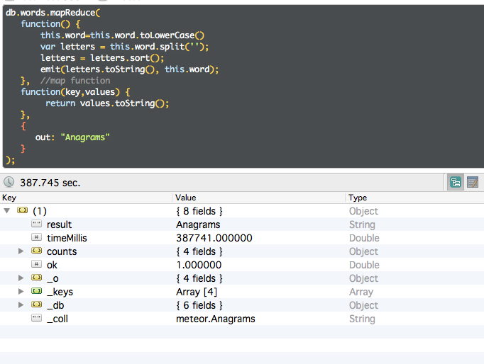

<!-- START doctoc generated TOC please keep comment here to allow auto update -->
<!-- DON'T EDIT THIS SECTION, INSTEAD RE-RUN doctoc TO UPDATE -->
**Table of Contents**  *generated with [DocToc](http://doctoc.herokuapp.com/)*

- [Wojciech Nowak](#wojciech-nowak)
      - [Sprzęt](#sprzęt)
      - [Wersje oprogramowania](#wersje-oprogramowania)
- [Zadania 3](#zadania-3)
  - [Przygotować funkcje map i reduce, które:](#przygotować-funkcje-map-i-reduce-które)
    - [wyszukają wszystkie anagramy w pliku word_list.txt](#wyszukają-wszystkie-anagramy-w-pliku-word_listtxt)
      - [MongoDB](#mongodb)
        - [Przygotowanie](#przygotowanie)
        - [Import](#import)
        - [Map reduce anagram list](#map-reduce-anagram-list)
    - [wyszukają najczęściej występujące słowa z Wikipedia data PL aktualny plik z artykułami, ok. 1.3 GB](#wyszukają-najczęściej-występujące-słowa-z-wikipedia-data-pl-aktualny-plik-z-artykułami-ok-13-gb)
      - [import](#import)
      - [Map Reduce  w wersji zoptymalizowanej na wiele wątków.](#map-reduce--w-wersji-zoptymalizowanej-na-wiele-wątków)
        - [ScopedThread](#scopedthread)

<!-- END doctoc generated TOC please keep comment here to allow auto update -->

# Wojciech Nowak 
* nr albumu 206354 Informatyka I rok Magisterskie

####Sprzęt
* procesor: 

		Model:								  Intel Core i7-4650U
		Szybkość procesora:					1,7 GHz  
		Łączna liczba rdzeni:					2    
		Pamięć podręczna L2 (na rdzeń): 	  256KB    
		Pamięć podręczna L3: 				 4MB
		
* pamięć ram:

		Rozmiar: 		8GB 
		Typ:			DDR3
		Prędkość:	   1600MHz

* dysk: 

		model: 			SSD Samsung sm0256f 
		magistrala:		PCIe SSD
		
####Wersje oprogramowania
* MongoDB shell version: 	
        2.8.0-rc4
* OS: Mac OS X 				10.10 (14B25)
* Python:
       2.7.8
       
#Zadania 3

##Przygotować funkcje map i reduce, które:

###wyszukają wszystkie anagramy w pliku word_list.txt

####MongoDB

komenda importu:

	>> time mongoimport --type csv -c Words --file anagram/word_list.txt -f word
	2015-01-02T19:11:38.073+0100    connected to: localhost
    2015-01-02T19:11:38.271+0100    imported 8199 documents
    
    real    0m0.224s
    user    0m0.059s
    sys     0m0.016s

komenda wstępna map reduce bez ScopedThread, którego użyjemy do importu wikiepdii.

```js
db.Words.mapReduce(
   function() {
       var letters = this.word.split('');
       letters = letters.sort();
       emit(letters, this.word);
   },  //map function
   function(key,values) {
        var all="";
        for(var i in values) {
            all+=values[i]+",";
        }
        return all;
   },
   {
      out: "words_analysis"
   }
);
```

doszedłem do wniosku, że mogę korzystając z frameworka meteor oraz łatwego dostępu do więszej bazy polskich słów
[jak http://sjp.pl/slownik/odmiany/](http://sjp.pl/slownik/odmiany/) 

zbuduje aplikacje wyszukującą anagramy w czasie rzeczywistym, najpierw pobrałem baze jednak wymaga

#####Przygotowanie
    
1. zamiany kodowania z win-1250 na utf-8:


    >time iconv -f CP1250 -t utf-8 odm.txt > odm_utf-8.txt
    
    real	0m0.988s
    user	0m0.860s
    sys	0m0.111s
    

2. usunięcia "," zastąpienia ich znakiem nowej linni.


    > time cat odm_utf-8.txt | tr -d " "  | tr "," "\n" > odm.csv
    
    real	0m7.668s
    user	0m14.790s
    sys	0m0.229s


3. baza ma słów
    
    
    > cat odm.csv | wc -l 
    3 827 632


#####Import

1. zajmiemy się importem do mongodb meteor js

    >> time mongoimport -h localhost:3001 -d meteor -c words -f word --type csv --file odm.csv 
    2015-01-06T01:32:21.502+0100	imported 3827632 documents

    real	1m48.404s
    user	0m30.262s
    sys	    0m2.449s
    
#####Map reduce anagram list

```js
db.words.mapReduce(
   function() {
       var letters = this.word.split('');
       letters = letters.sort();
       emit(letters.toString(), this.word);
   },  //map function
   function(key,values) {
        return values.toString();
   },
   {
      out: "anagrams"
   }
);
```
time około 7 min




###wyszukają najczęściej występujące słowa z Wikipedia data PL aktualny plik z artykułami, ok. 1.3 GB

####import

1. Pobranie xml'a (38mb, couple minutes)


    > wget http://dumps.wikimedia.org/plwiki/20141228/plwiki-20141228-pages-articles-multistream.xml.bz2


2. unzip it (180mb, couple seconds)


    > bunzip2 ./plwiki-20141228-pages-articles-multistream.xml.bz2


3. load it into mongo


    > time node index.js plwiki-20141228-pages-articles-multistream.xml
    
    =================done========
    real    288m21.964s
    user    257m31.175s
    sys     6m15.147s

    
####Map Reduce  w wersji zoptymalizowanej na wiele wątków.

##### ScopedThread
    niestety ScopedThread został usunięty w wersji 2.6, ponieważ był on tylko używany do pisania testów
    https://jira.mongodb.org/browse/SERVER-13485

    Istnieje obejście tego problemu poprzez załadowanie

    >> curl -O https://raw.githubusercontent.com/mongodb/mongo/master/jstests/libs/parallelTester.js

1. Załadowanie ScopedThread


        // curl -O https://raw.githubusercontent.com/mongodb/mongo/master/jstests/libs/parallelTester.js
    
    
        load("parallelTester.js");
    
    
2. Podział na paczki:
    

    var res = db.runCommand({splitVector: "pl_wikipedia.wikipedia", keyPattern: {_id: 1}, maxChunkSizeBytes: 4 * 1024 *1024 * 1024 });
    
    
3. Funkcja odpalana w wątkach:


    var mapred = function(id, page) {
        return db.runCommand({
                mapreduce: "wikipedia",
                map: function () {
                    if(this.hasOwnProperty('text')) {
                        var words = [];
                        for (var name_text in this.text) {
                            for (var i = 0; i < this.text[name_text].length; i++) {
                                words = words.concat(this.text[name_text][i].text.split(' '));
                            }
                        }
                        for (var i = 0; i <= words.length; i++)
                            emit(words[i], 1);
                    }
                },
                reduce: function (key, values) { return Array.sum(values); },
                out: { replace: "mrout" + id, db: "mrdb" + id },
                sort: {_id: -1},
                query: { _id: { $lt: id} },
                limit: page
            })
    };
    
4. odpalenie


        >> load("map_reduce.js");
        2015-01-05T14:56:28.966+0100 I CONTROL  [initandlisten]
        id:54aca1cc2c9d2a4b4ea38e9f
        id:54acad102c9d2a4b4ea75f30
        id:54acb9692c9d2a4b4eab2fc1
        id:54acc5b22c9d2a4b4eaf0053
        id:54accfdf2c9d2a4b4eb2d0e4
        connecting to: pl_wikipedia
        connecting to: pl_wikipedia
        connecting to: pl_wikipedia
        connecting to: pl_wikipedia
        connecting to: pl_wikipedia
    
    
5. Analiza:

        Liczba emitów


        Faktycznie zużyte są wszystkie rdzenie logiczne i fizyczne.


